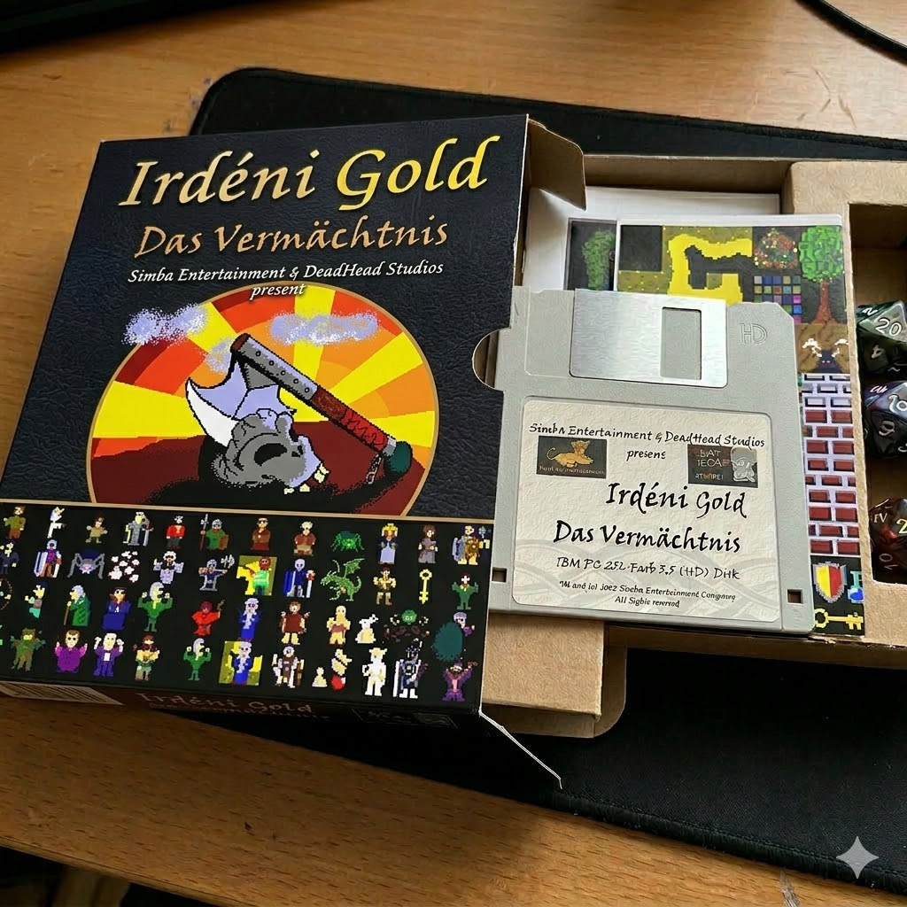
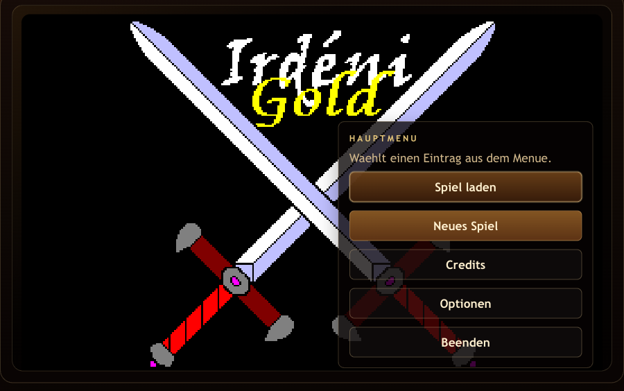
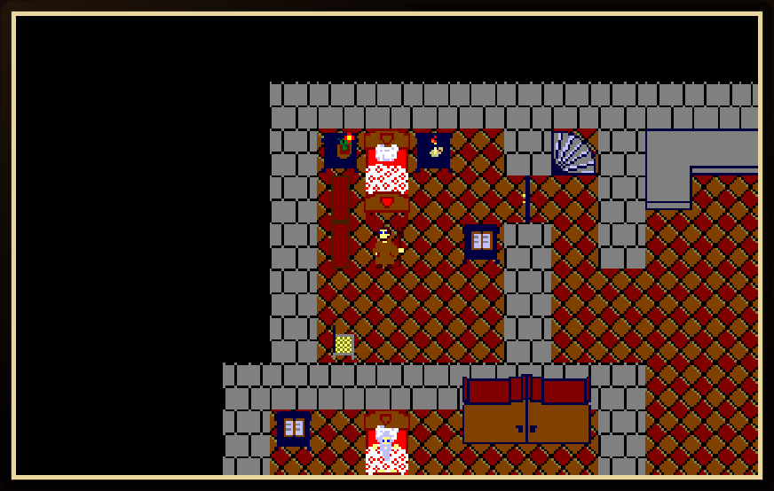
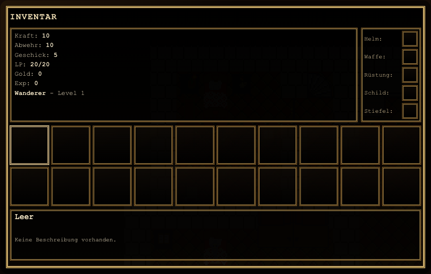

# Irdeni

<p align="center">
  
</p>

<p align="center">
  A high-school QuickBasic game preserved in full and rebuilt so it can be played again.
</p>

<p align="center">
  <a href="https://kalinbas.github.io/irdeni/"><strong>Play live in German</strong></a>
  ·
  <a href="https://kalinbas.github.io/irdeni/?lang=en"><strong>Play in English</strong></a>
  ·
  <a href="https://kalinbas.github.io/irdeni/?lang=es-mx"><strong>Jugar en español de México</strong></a>
</p>

We originally made Irdeni during high school, and because of that this project has a lot of emotional value for us. This repository exists to make that game playable again on modern machines and in modern browsers, while staying as close as possible to the original work.

It also contains the full original source code and assets. A lot of effort went into making this game in the first place, so preserving everything matters just as much as getting it running again.

## Screenshots

These screenshots were captured from the current browser build with Playwright.

<p align="center">
  
  
</p>

<p align="center">
  
</p>

## Why This Repo Exists

The goal of this GitHub project is not to remake Irdeni into something completely different. The goal is to preserve the original game, keep the original source available, and make the adventure playable again without losing the feel, logic, and personality it had from the start.

## What This Project Preserves

- The full original QuickBasic source code and historical project files
- The Gold Edition event data from `d_irdeni/ird_gold/DATA.SBT`
- Original maps, including recovered backup content
- Original sprite sheets, animated tiles, item graphics, and title/death screens
- Original event behavior such as branching dialogue, shops, battles, map mutations, and inventory usage

## What The Web Version Adds

- Browser play on modern desktop and mobile devices
- GitHub Pages deployment
- Responsive scaling for large screens and mobile landscape
- Modern save/load through the browser
- A cleaner inline UI for dialogue, inventory, journal, shops, and menu screens

## Play

- Live game, German default: [kalinbas.github.io/irdeni](https://kalinbas.github.io/irdeni/)
- Live game, English: [kalinbas.github.io/irdeni/?lang=en](https://kalinbas.github.io/irdeni/?lang=en)
- Live game, Mexican Spanish: [kalinbas.github.io/irdeni/?lang=es-mx](https://kalinbas.github.io/irdeni/?lang=es-mx)
- Short Spanish alias: [kalinbas.github.io/irdeni/?lang=es](https://kalinbas.github.io/irdeni/?lang=es)
- Local dev server: `http://localhost:5173/`

If this project is deployed from another GitHub account, the GitHub Pages URL becomes `https://<owner>.github.io/irdeni/`.

## Controls

| Key | Action |
| --- | --- |
| `Arrow Keys` | Move or navigate menus |
| `Enter` / `Space` | Confirm, interact, or advance text |
| `B` | Use the selected item where supported |
| `I` | Open inventory |
| `J` | Open journal |
| `S` | Quicksave |
| `F` | Maximize the game window |
| `Shift + F` | Browser fullscreen |
| `Esc` | Menu, back, or close the current screen |

## Repository Layout

| Path | Purpose |
| --- | --- |
| `d_irdeni/` | Original QuickBasic source, maps, event files, editors, disk image, and historical assets |
| `web/` | React + Vite web port |
| `docs/` | Rebuild notes and README media |

## Run Locally

```bash
cd web
npm ci
npm run dev
```

The content extraction step is built into the dev and build commands, so the web app always rebuilds from the original game data before serving or shipping.

## Build For Production

```bash
cd web
npm run build
```

The GitHub Actions workflow in `.github/workflows/deploy.yml` publishes the built web app to GitHub Pages on pushes to `main`.

## Credits

The original game credits are preserved in the project and in the running game:

- Base programming: Bastian Kaelin
- Graphical design: Bastian Kaelin and Simon Junker
- Level design: Simon Junker
- Story and event programming: Bastian Kaelin and Simon Junker
